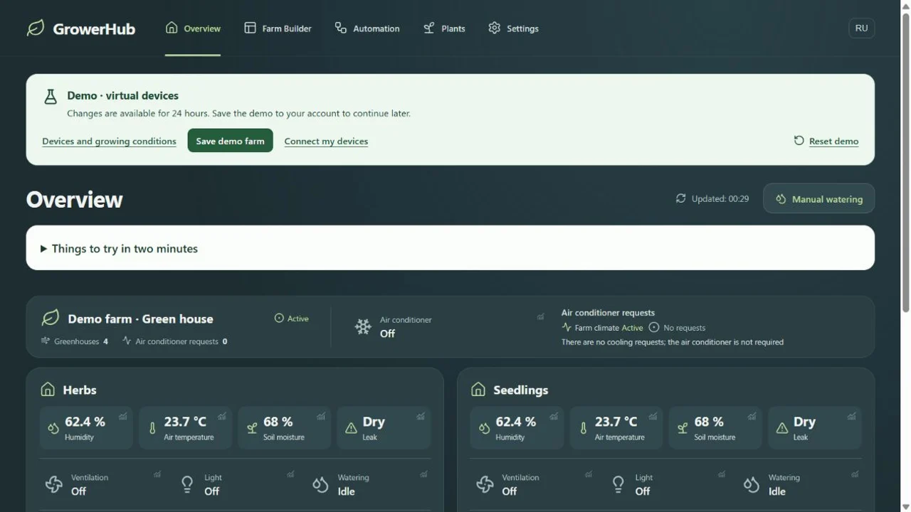

# GrowerHub

[](https://github.com/aspinozaxxx-lab/growerhub/actions/workflows/ci-firmware.yml)
[](https://github.com/aspinozaxxx-lab/growerhub/actions/workflows/ci-cd-backend.yml)
[](https://github.com/aspinozaxxx-lab/growerhub/actions/workflows/deploy-frontend.yml)

[Try the demo — no sign-up](https://growerhub.ru/app/demo/?lang=en&utm_source=github&utm_medium=referral&utm_campaign=demo_launch&utm_content=readme_top_en) ·
[Демо без регистрации](https://growerhub.ru/app/demo/?lang=ru&utm_source=github&utm_medium=referral&utm_campaign=demo_launch&utm_content=readme_top_ru) ·
[Feedback / Отзыв](https://github.com/aspinozaxxx-lab/growerhub/issues/new?template=demo-feedback.yml) ·
[Сайт](https://growerhub.ru/) ·
[Начать работу](https://growerhub.ru/kak-nachat/) ·
[История и эксплуатационные данные](https://growerhub.ru/about/) ·
[English](#english)

GrowerHub — открытая платформа управления теплицей или мини-фермой. Она
объединяет Zigbee2MQTT, MQTT-устройства, зоны, историю датчиков и сценарии
управления в одном веб-интерфейсе.



*Виртуальные устройства и демонстрационные показания / Virtual devices with simulated readings.*

Проект начинался с ESP32-контроллера полива, который позже получил имя Grovika.
После эксплуатации и нескольких архитектурных итераций GrowerHub вырос в
многопользовательскую self-service-платформу с изолированными координаторами,
MQTTS и автоматизациями.

## Попробовать до подключения оборудования

Демоферма открывается в браузере: четыре теплицы с разным микроклиматом,
растения, история датчиков и поливов уже настроены. Это общее приложение
GrowerHub с виртуальными устройствами. У каждого посетителя своя песочница;
демокоманды не управляют физическим оборудованием.

- [Посмотреть датчики и историю](https://growerhub.ru/app/demo/?lang=ru&view=overview&utm_source=github&utm_medium=referral&utm_campaign=demo_launch).
- [Настроить свет, климат и полив](https://growerhub.ru/app/demo/?lang=ru&view=automations&utm_source=github&utm_medium=referral&utm_campaign=demo_launch).
- [Попробовать ручной полив](https://growerhub.ru/app/demo/?lang=ru&view=watering&utm_source=github&utm_medium=referral&utm_campaign=demo_launch).

Гостевое демо живёт 24 часа. Чтобы вернуться к своим изменениям позже,
нажмите «Сохранить демоферму» и войдите в аккаунт. Для реального оборудования
есть [путь подключения](https://growerhub.ru/kak-nachat/) и
[помощь проекта](https://t.me/growerhub_info?direct).

После знакомства можно [оставить отзыв на GitHub](https://github.com/aspinozaxxx-lab/growerhub/issues/new?template=demo-feedback.yml).
Достаточно написать, что попробовали и что получилось или оказалось непонятным.

## Проверяемая история

- публичная история разработки начинается 6 октября 2025 года;
- в основной ветке зафиксировано более 770 коммитов;
- ранние MQTT-команды, Grovika, переход с FastAPI на Java/Spring, новая модель
  датчиков и насосов, Zigbee2MQTT и self-service видны в истории Git;
- production хранит длительные ряды телеметрии и журнал действий; обезличенный
  датированный срез опубликован на странице
  [«О проекте»](https://growerhub.ru/about/).

Если проект оказался полезен, поставьте ему звезду — это помогает GrowerHub
становиться заметнее и находить новых пользователей.

## Состав

- `backend` — Java Spring Boot, REST API, MQTT, домены и миграции PostgreSQL;
- `frontend` — React/Vite, публичный двуязычный сайт и кабинет;
- `firmware` — прошивка Grovika на C++/PlatformIO;
- `zigbee_coordinator` — Zigbee2MQTT и connector для Windows и Linux;
- `ansible` — серверная инфраструктура и роли деплоя;
- `docs/architecture` — обязательная архитектурная документация.

## Основные команды

```bash
# Backend
cd backend
./gradlew test

# Frontend
cd frontend
npm ci
npm run build

# Firmware
cd firmware
pio test
pio run
```

Главный архитектурный документ:
[`docs/architecture/architecture.md`](docs/architecture/architecture.md).

## English

[Try the demo farm — no sign-up or hardware](https://growerhub.ru/app/demo/?lang=en&utm_source=github&utm_medium=referral&utm_campaign=demo_launch).
Explore four greenhouses with different sensor readings and history, edit
lighting and watering schedules, and try a virtual watering session. Each
visitor gets a separate demo farm in the same application as physical farms.
Guest data lasts 24 hours; sign in and save the demo to keep your changes.

[Share demo feedback on GitHub](https://github.com/aspinozaxxx-lab/growerhub/issues/new?template=demo-feedback.yml):
tell us what you tried and what worked or felt unclear. English and Russian are welcome.

GrowerHub is an open greenhouse and small-farm management platform. It brings
Zigbee2MQTT, MQTT devices, zones, sensor history, and control scenarios into one
web interface.

The project began with an ESP32 irrigation controller later named Grovika.
Operational use and several architectural iterations turned it into a
multi-user self-service platform with isolated coordinators, MQTTS, and
automations.

The public Git history starts on October 6, 2025 and contains more than 770
commits. A dated, privacy-safe operational snapshot is available on the
[GrowerHub experience page](https://growerhub.ru/en/about/).

If GrowerHub is useful to you, please give the repository a star. It helps new
users discover the project.
